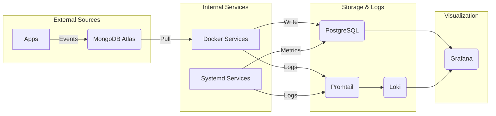

# Self-Hosted Observability Hub

A **production-grade telemetry platform** architected to demonstrate **SRE & Platform Engineering principles**: full-stack observability, **GitOps-driven infrastructure**, and standardized data ingestion. It unifies **system metrics**, **application events**, and **logs** into a single queryable layer using **PostgreSQL (TimescaleDB)** and **Loki**, visualized via **Grafana**.

---

## 🌐 Live Site

[Explore Live Telemetry & System Evolution](https://victoriacheng15.github.io/observability-hub/)

---

## 🏗️ Engineering Principles

- **Unified Observability & Standardization:** Eliminates data silos by correlating host-level infrastructure metrics (CPU/Memory/IO) with application-level business events. This provides a **"Golden Path"** for telemetry, ensuring all services are observed via a consistent standard.
- **API-Driven Abstraction:** The `proxy` service acts as a **Platform Interface**, decoupling data ingestion from storage. Client apps (like Cover Craft) emit events to a simple endpoint (MongoDB), while the platform handles the complexity of ETL and efficient **TimescaleDB** storage.
- **GitOps & Self-Healing:** Implements a custom **reconciliation engine** (`gitops-sync`) to enforce state consistency between the Git repository and the host, ensuring **configuration drift** is automatically corrected without manual intervention.
- **Hybrid Runtime Architecture:** leverages the right tool for the job—containerizing stateless services (Docker) while running privileged automation agents directly on the host (Systemd) for reliability and access to kernel-level stats.
- **High-Performance Storage:** Optimizes for high-volume time-series write throughput and geospatial analysis using **TimescaleDB** hypertables and **PostGIS**, avoiding the operational overhead of managing separate specialized databases.

---

## 🛠️ Tech Stack


---

## 📚 Architectural Approach & Documentation

This section provides a deeper look into the system's structure, components, and data flow.

### System Architecture Diagram

This diagram shows the high-level flow of data from collection to visualization.



### Component Breakdown

This table lists the main services and components within the observability hub, along with their responsibilities and location within the repository.

| Service / Component | Responsibility | Location |
| :------------------ | :------------- | :------- |
| **system-metrics** | A lightweight Go collector that gathers CPU, memory, disk, and network stats. | `system-metrics/` |
| **proxy** | A Go service acting as an API gateway and ETL engine for external data (e.g., MongoDB events). | `proxy/` |
| **page** | A Go static-site generator that builds the public-facing portfolio page. | `page/` |
| **PostgreSQL** | Primary time-series database for all metric and event data (with TimescaleDB and PostGIS extensions). | `docker-compose.yml` |
| **Grafana** | Primary visualization and dashboarding tool. | `docker-compose.yml` |
| **Loki** | Log aggregation system for all services. | `docker-compose.yml` |
| **Promtail** | Agent that ships host and container logs to Loki. | `docker-compose.yml` |
| **gitops-sync** | A `systemd` service that ensures the running state on the host matches the Git repository. | `systemd/` |
| **reading-sync** | A `systemd` service that periodically triggers the `proxy` ETL process via API. | `systemd/` |
| **Shared Libraries** | Reusable Go packages providing standardized logging, database connections, and common utilities. | `pkg/` |
| **Automation Scripts** | Collection of `scripts/` for maintenance, setup, and operational tasks. | `scripts/` |

### External Dependencies

These components exist outside this repository but are integral to the data pipeline:

| Dependency | Role |
| :--- | :--- |
| **Client Applications** | Sources of event data (e.g., Cover Craft, Personal Reading Analytics). |
| **MongoDB Atlas** | Interim cloud storage used as a buffer/queue for external event logs. |

### Data Flow

The system processes two main types of data: application events and host system metrics.

1. **Application Events (ETL Pipeline):**
    - **Source:** Client Applications (e.g., Cover Craft, Personal Reading Analytics Dashboard) write raw event logs to **MongoDB Atlas** (cloud).
    - **Ingestion:** The **reading-sync** service periodically triggers the **proxy** service.
    - **Transformation:** The **proxy** fetches new data from MongoDB, transforms it, and persists structured records into **PostgreSQL**.
2. **Host System Metrics:**
    - The **system-metrics** service (running on the host) collects CPU, Memory, Disk, and Network statistics.
    - Metrics are flushed directly to **PostgreSQL** at regular intervals.
3. **Visualization:**
    - **Grafana** queries **PostgreSQL** to visualize both application events and system health on unified dashboards.
4. **Logging:**
    - **Unified Aggregation:** **Promtail** tails logs from Docker containers (like `proxy`) and Systemd units (like `system-metrics`).
    - **Centralized Storage:** Logs are shipped to **Loki** and linked to metrics in Grafana for seamless correlation.

For deep dives into the system's inner workings:

- **[Detailed Architecture Docs](./docs/architecture/README.md)**: System context, component diagrams, and data flows.
- **[Decision Records](./docs/decisions/README.md)**: Architectural Decision Records (ADRs) explaining the "Why" behind key technical choices.

---

## 🚢 Deployment Strategy

The platform employs a **Hybrid Deployment Model** to balance security, reliability, and convenience:

### 1. Core Infrastructure (Pull-based GitOps)

The critical observability stack (Postgres, Grafana, Proxy) and host configurations are managed by a **self-hosted reconciliation agent** (`gitops-sync`).

- **Mechanism:** A systemd timer triggers a local script every 15 minutes.
- **Action:** Pulls the latest `main` branch, diffs the state, and applies changes (e.g., restarts services, updates crons).
- **Benefit:** Eliminates the need for inbound SSH access or sensitive secrets in external CI pipelines.

### 2. Public Portfolio (Push-based CI/CD)

The static status page is built and deployed via **GitHub Actions**.

- **Mechanism:** Standard CI pipeline defined in `.github/workflows/deploy.yml`.
- **Action:** Builds the Go `page` generator and deploys the output to GitHub Pages.
- **Benefit:** Fast feedback loops and high availability for the public-facing component.

---

## 🚀 Getting Started (Local Development)

This guide will help you set up and run the `observability-hub` locally using Docker Compose.

### Prerequisites

Ensure you have the following installed on your system:

- [Go](https://go.dev/doc/install) (version 1.21 or newer)
- [Docker Desktop](https://www.docker.com/products/docker-desktop/) (includes Docker Compose)
- `make` (GNU Make)

### 1. Configuration

The project uses a `.env` file to manage environment variables, especially for database connections and API keys.

```bash
# Start by copying the example file
cp .env.example .env
```

You will need to edit the newly created `.env` file to configure connections for MongoDB Atlas, PostgreSQL, and other services as required.

### 2. Build and Run the Stack

Bring up all services defined in `docker-compose.yml` with a single command:

```bash
make up
```

This command will:

- Build all necessary Docker images for the Go services.
- Start and provision all containerized services (PostgreSQL, Grafana, Loki, Promtail).
- The `-d` flag runs the services in the background.

To view the logs of all running services:

```bash
docker compose logs -f
```

### 3. Verification

Once the services are up and running, you can verify their functionality:

- **Grafana Dashboards:** Access Grafana at `http://localhost:3001`.
  - Default login: `admin` / `grafana`
  - You should see your provisioned data sources and dashboards.
- **Static Portfolio Site:** The `page` service builds your public portfolio site into the `page/dist` directory. You can inspect the generated static HTML files there.

### 4. Stopping the Stack

To stop and remove all running services and their associated containers, volumes, and networks:

```bash
make down
```
