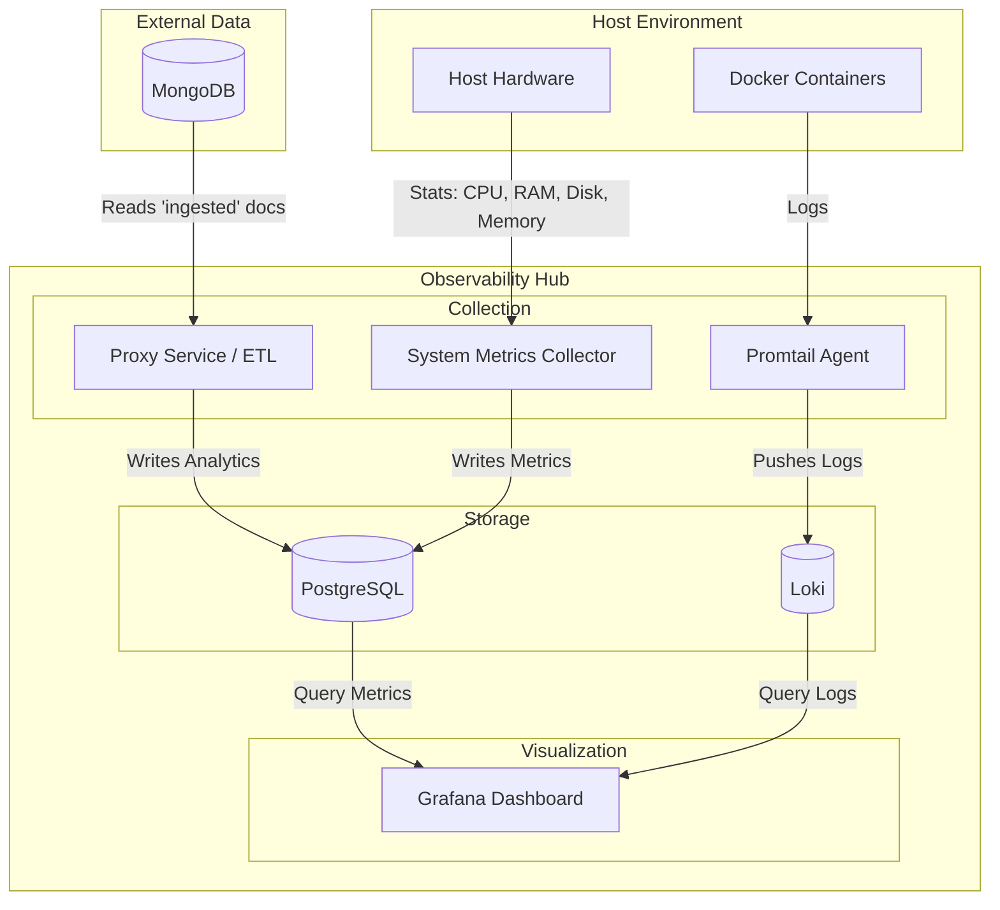

# Observability Hub Architecture

This document serves as the entry point for the system's architecture.

## System Context

The hub integrates standard observability tools with custom Go services.

## Detailed Architecture Documents

| Component | Description |
| :----------- | :------------- |
| **[Proxy Service](./proxy-service.md)** | Architecture of the Go-based API Gateway and ETL Engine. |
| **[System Metrics](./system-metrics.md)** | Details on the custom host telemetry collector (`gopsutil`). |
| **[Infrastructure](./infrastructure.md)** | Deployment (Docker), Storage (Postgres/Loki), and Security config. |

## Related Documentation

- **[Decisions](../decisions/)**: Architecture Decision Records (ADRs).
- **[Planning](../planning/)**: Future trends and RFC drafts.
