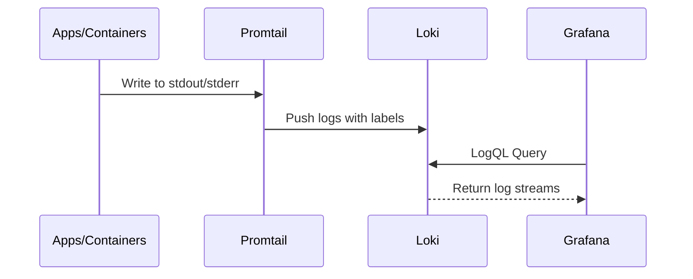

# Infrastructure & Deployment

The infrastructure layer manages storage, log aggregation, and visualization, orchestrated via Docker Compose.

## Component Details

| Component | Role | Details |
| :--- | :--- | :--- |
| **PostgreSQL** | Primary Storage | Central store for time-series metrics (`system_metrics`) and analytical data (`reading_analytics`). |
| **Loki** | Log Aggregation | Indexes metadata (labels) from logs pushed by Promtail. |
| **Grafana** | Visualization | Unified dashboard connecting to PostgreSQL (Metrics) and Loki (Logs). |
| **Promtail** | Log Agent | Discovers Docker logs, attaches tags (container name, job), and pushes to Loki. |

## Data Flow: Promtail Logging

## Deployment Strategy

- **Orchestration**: `docker-compose.yml` for local and server environments.
- **Automation**: `Makefile` for lifecycle management (backup, restore, restart).
- **Persistence**: External Docker volumes (`postgres_data`, `grafana_data`, `loki_data`).

## Configuration & Security

### Environment Variables (.env)

- **Database**: `POSTGRES_PASSWORD`, `DB_USER`, `DB_PASSWORD`.
- **Grafana**: `GF_SECURITY_ADMIN_PASSWORD`.
- **Ports**: `PORT` (Proxy), `DB_PORT`.
- **External**: `MONGO_URI`.

### Network Security

- **Isolation**: Services communicate on an internal Docker network.
- **Exposed Ports**:
  - `3001`: Grafana (UI)
  - `3100`: Loki (Logs)
  - `5432`: PostgreSQL (Data access)
  - `8085`: Proxy Service (API)
