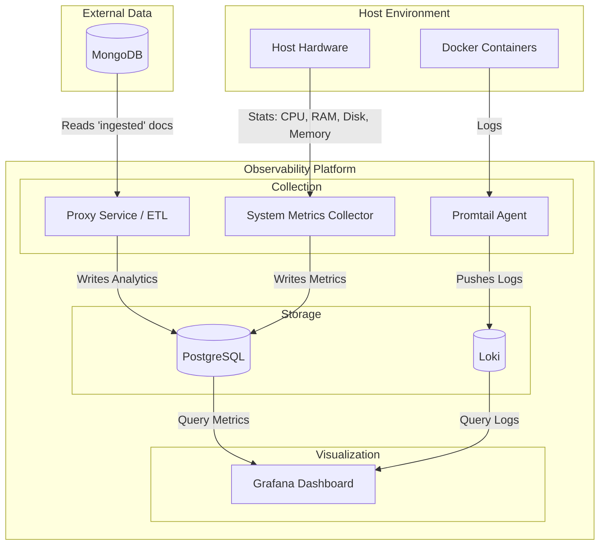
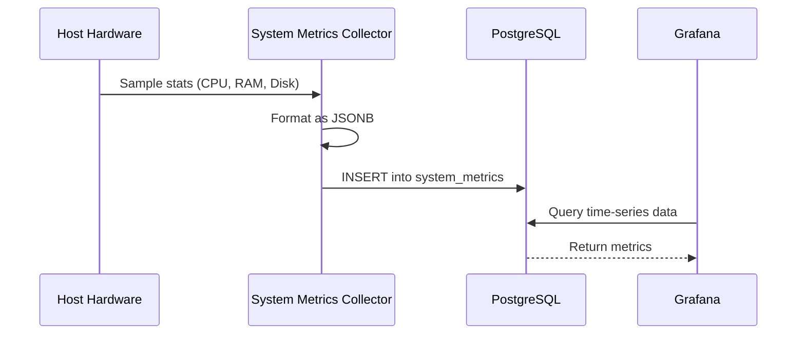
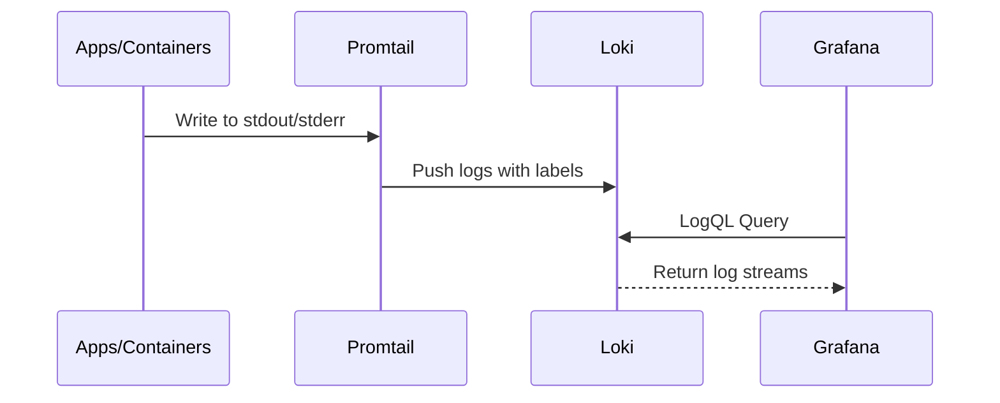
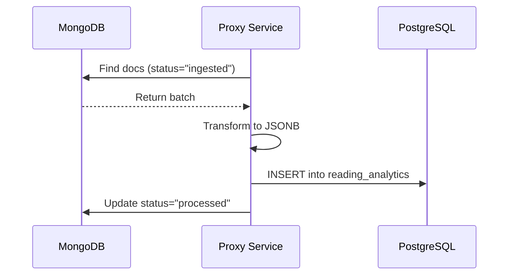

# Observability System Architecture

This document provides a high-level overview of the Observability Platform's architecture, detailing how data is collected, processed, and visualized.

## 1. Overview

The platform is designed to provide comprehensive visibility into system health and application logs. It integrates standard observability tools (Grafana, Loki, PostgreSQL) with custom-built Go services to handle specialized ETL tasks and telemetry collection.

### High-Level Architecture Diagram

## 2. System Components

### 2.1 Storage & Visualization (Core)

- **PostgreSQL**: Serves as the central time-series and analytical data store.
  - Stores hardware metrics in the `system_metrics` table.
  - Stores synchronized application data in the `reading_analytics` table.
- **Loki**: Optimized log aggregation system that indexes metadata from logs sent by Promtail.
- **Grafana**: The unified visualization layer. It connects to both PostgreSQL and Loki as data sources to provide dashboards for metrics and logs.

### 2.2 Custom Services (Go)

- **Proxy Service (`proxy/`)**:

  - **API Gateway**:

    - `GET /`: Returns a welcome message ("Welcome to the Observability Platform").

    - `GET /api/reading`: A placeholder endpoint for future reading retrieval features.

  - **ETL Engine**:

    - `GET /api/sync/reading`: Extracts data from an external MongoDB instance, transforms it into a structured format, and loads it into PostgreSQL for long-term analysis.

- **System Metrics Collector (`system-metrics/`)**:
  - A lightweight agent that runs on the host system.
  - Collects CPU, Memory, Disk, and Network statistics using the `gopsutil` library.
  - Directly pushes telemetry to PostgreSQL.

### 2.3 Log Collection

- **Promtail**: Runs as a sidecar/agent that discovers Docker container logs, attaches labels (e.g., container name, job), and pushes them to Loki.

## 3. Data Flow

### 3.1 Metrics Flow

### 3.2 Log Flow

### 3.3 Analytical ETL Flow

## 4. Deployment & Infrastructure

- **Containerization**: The entire core stack (Postgres, Loki, Grafana, Proxy, Promtail) is containerized using Docker.
- **Orchestration**: Managed via `docker-compose.yml` for local and server deployment.
- **Automation**: A `Makefile` provides standardized commands for volume management (backups/restores) and service lifecycle (rebuilds/restarts).
- **Persistence**: Data is persisted across container restarts using external Docker volumes (`postgres_data`, `grafana_data`, `loki_data`).

## 5. Configuration & Security

### 5.1 Environment Configuration

The system relies on a centralized `.env` file for configuration. Key variables include:

- **Database Credentials**: `POSTGRES_PASSWORD`, `DB_USER`, `DB_PASSWORD`.
- **Grafana Security**: `GF_SECURITY_ADMIN_PASSWORD` for the initial admin login.
- **Service Ports**: `PORT` (Proxy), `DB_PORT`.
- **External Connections**: `MONGO_URI` for the ETL source.

### 5.2 Database Security

- **Role Isolation**: The system is designed to use a specific application user (e.g., `server`) rather than the default superuser for day-to-day operations.
- **Connection Security**: Services connect via standard PostgreSQL authentication. In production, `sslmode` should be enabled (currently set to `disable` for local dev).

### 5.3 Network Isolation

- **Docker Network**: Services communicate over an internal Docker network, limiting exposure.
- **Port Mapping**: Only necessary ports are exposed to the host:
  - `3001`: Grafana (UI)
  - `3100`: Loki (Logs)
  - `5432`: PostgreSQL (Data access)
  - `8085`: Proxy Service (API)
