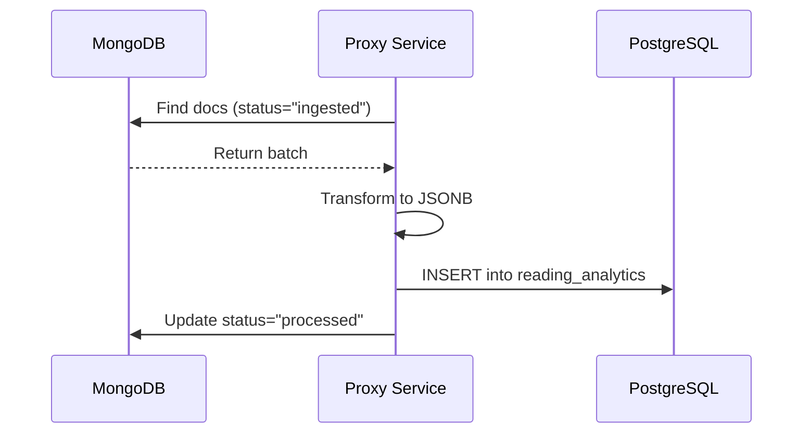

# Proxy Service Architecture

The Proxy Service (`proxy/`) is a custom Go application that acts as the API gateway and ETL engine for the platform. It bridges external data sources with the internal PostgreSQL storage.

## Component Details

### API Overview

| Endpoint | Method | Purpose |
| :--- | :--- | :--- |
| `/` | GET | Returns a JSON welcome message. |
| `/api/reading` | GET | Placeholder for future reading retrieval features. |
| `/api/sync/reading` | GET | Synchronizes reading data from MongoDB to PostgreSQL. |

### Endpoint Details

#### ETL Engine (`/api/sync/reading`)

This endpoint triggers the extraction, transformation, and loading of data.

1. **Connect**: Establishes connection to MongoDB using `MONGO_URI`.
2. **Query**: Finds documents in the source collection where `status="ingested"`.
3. **Transform**: Converts documents into a standardized JSONB format.
4. **Load**: Inserts records into the PostgreSQL `reading_analytics` table.
5. **Update**: Marks the original MongoDB documents as `status="processed"`.

## Data Flow: Analytical ETL

