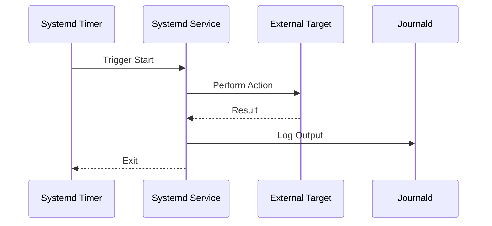

# Systemd Service Architecture

The Observability Hub leverages **Systemd** not just for process management, but as a core automation and reconciliation engine. By running lightweight agents and timers directly on the host, we ensure reliability independent of the Docker container runtime.

## Core Philosophy

- **Decoupling**: Critical maintenance (like GitOps sync) runs outside containers to avoid "circular dependencies" (e.g., waiting for Docker to start to fix a Docker config).
- **Native Scheduling**: We use `systemd` timers instead of cron for better logging, dependency management, and accuracy.
- **Unified Logging**: All services emit logs to `standard output`, which are captured by `journald` and scraped by Promtail.

## Service Inventory

The system consists of several main service families, each with a `.service` unit (the logic) and a `.timer` unit (the schedule).

| Service Name | Type | Schedule | Responsibility |
| :--- | :--- | :--- | :--- |
| **`gitops-sync`** | `oneshot` | Every 15 min | **Reconciliation**: Pulls the latest Git code and applies changes (e.g., reloading units, syncing scripts). |
| **`reading-sync`** | `oneshot` | Daily (10:00 AM) | **ETL Trigger**: Calls the Proxy Service API (`/api/sync/reading`) to sync MongoDB data to Postgres. |
| **`system-metrics`** | `oneshot` | Every 1 min | **Telemetry**: Collects host hardware stats (CPU/RAM/Disk/Net) and flushes them to the database. |
| **`volume-backup`** | `oneshot` | Daily (01:00 AM) | **Backup**: Triggers `manage_volume.sh` to backup Docker volumes. |

## Operational Excellence

Our systemd configurations employ several production-grade patterns:

- **Persistence (`Persistent=true`)**: Used in `reading-sync`. If the host is powered off during the scheduled time (10:00 AM), systemd will trigger the service immediately upon the next boot.
- **Jitter (`RandomizedDelaySec`)**: Prevents "thundering herd" issues by adding a random delay (up to 30 mins for `reading-sync`) to the start time, which is critical when multiple instances are managed across a fleet.
- **Accuracy (`AccuracySec=1s`)**: Used in `system-metrics` to ensure high-fidelity sampling intervals for time-series data.

## Architectural Patterns

### 1. The "Timer-Trigger" Pattern

For periodic tasks like ETL or GitOps, we use the `oneshot` service pattern triggered by a timer. This ensures:

- **Idempotency**: Services are designed to run, complete their task, and exit.
- **Resilience**: If a job fails, systemd handles the retry logic or logs the failure state without crashing a long-running daemon.

### 2. Logging & Observability Integration

Unlike traditional "write to file" approaches, our systemd units write strictly to `stdout`/`stderr`. This creates a unified pipeline:

1. **Emission**: Service writes to `stdout`.
2. **Capture**: `journald` captures the stream and adds metadata (timestamp, unit name, PID).
3. **Collection**: Promtail (configured with `job_name: systemd-journal`) tails the journal.
4. **Ingestion**: Promtail pushes logs to Loki for visualization in Grafana.

## Configuration Structure

All unit files are stored in the `systemd/` directory of the repository and are deployed/updated by the `gitops-sync` script itself.

- **`[Unit]`**: Defines dependencies (e.g., `After=network.target`).
- **`[Service]`**: Defines the `ExecStart` command and `User=server`.
- **`[Install]`**: Defines the target (usually `multi-user.target`).
